# Lab4-LOG430 – Test de charge et Observabilite

[](https://github.com/zakzaki244/Lab0-LOG430/actions)

Dans ce laboratoire j'ai effectué la correction des remarques du professeur Fabio et implémenter les fonctionnalitées correctement !
Vous pouvez essayer toute les nouvelles fonctionnalitées : `http://10.194.32.174:5000/login`

## 1. Architecture du projet

Le projet suit :
- `app.py` : 
  - Role : Point d’entrée Flask
    - enregistre les blueprints, configure Swagger, etc.
    - Iniitialise l’application Flask, 
    - Configure Swagger (documentation API), 
    - Enregistre les différents blueprints (web pour l’interface web, api pour l’API REST), 
    - Peut gérer la configuration globale, le CORS, les middlewares globaux, etc.
- `routes.py` : Routes API REST, Blueprint nommé api
  -  Role : Définit les routes REST API, utilisées par des clients externes ou du JavaScript front-end
     -  Utilise un Blueprint nommé api.
     -  Toutes les routes sont en /api/... (ex : /api/products, /api/ventes, etc.).
     -  Réponses toujours en JSON.
     -  Sécurisation possible via token.
     -  Contient des docstrings Swagger pour la documentation automatique.
- `web_routes.py` : Routes classiques pour le web (login, gestion HTML, ...), Blueprint nommé web
  - Role : Définit les routes classiques web (HTML), destinées à être utilisées par les utilisateurs via le navigateur.
    - Utilise un Blueprint nommé web.
    - Gère la connexion, l’affichage des pages HTML, les formulaires, etc
    - Retourne des templates HTML (ex : render_template("index.html", ...)).
    - Peut utiliser la session Flask pour l’authentification utilisateur.
    - Routage classique (ex : /login, /logout, /magasins, /products...).
- `src/db` : db.py / init_db.py
  - Role : Gestion de la base de données SQLAlchemy.
    - `db.py`: Définit la session, la connexion, le moteur, etc.
    - `init_db.py`: Script d’initialisation (création des tables, population de données...).
- `src/models/` : models.py, product.py, sale.py, store.py, etc.
  - Role : Définition des classes modèles ORM (SQLAlchemy) pour représenter les entités de la base (Product, Store, Sale, etc.).
- `src/services/` : product_service.py, sale_service.py, store_service.py, etc.
  - Role : Contient la logique métier (business logic) et les fonctions/services manipulant les entités (ex : création d’un produit, vente, remboursement, etc.). Elle sert d’interface entre les routes et les modèles. Elle permet de garder les routes propres et de factoriser le code métier.
- `src/templates/` : Fichiers HTML (Jinja2). Ce sont tous tes templates pour l’affichage côté utilisateur.

**Voici la difference entre les deux routes :**
web_routes.py permet aux utilisateurs d’utiliser le système dans un navigateur web. Mais routes.py sert à exposer les données et opérations pour des machines ou autres systèmes. Ainsi, le but principal de routes.py = rendre ton backend réutilisable et ouvert


> Pour accêder au metrics brut : http://10.194.32.174:5000/metrics
> 
---

## 2. Test de charge initial avec K6

Un test de charge est réalisé avec l’outil K6 pour simuler une montée en charge et observer les métriques suivantes : les 4 Golden Signals

- Latence (p95 / p99) : temps de reponse moyen
- Trafic/Requêtes par seconde
- Saturation : utilisation charge CPU / Mémoire, threads, pool de connexions.
-  Erreurs : taux de réponses HTTP 4xx ou 5xx.

### 🔍 Tableau de bord Grafana
Des dashboards Grafana sont utilisés pour visualiser les résultats du test :

- **Latence** (95e et 99e percentile) : 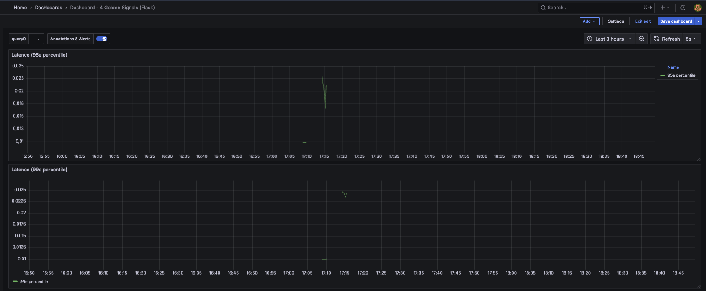
- **Requêtes par seconde** : 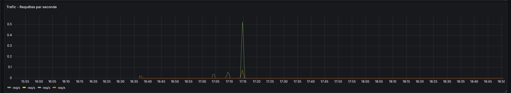
- **Utilisation CPU & RAM** : 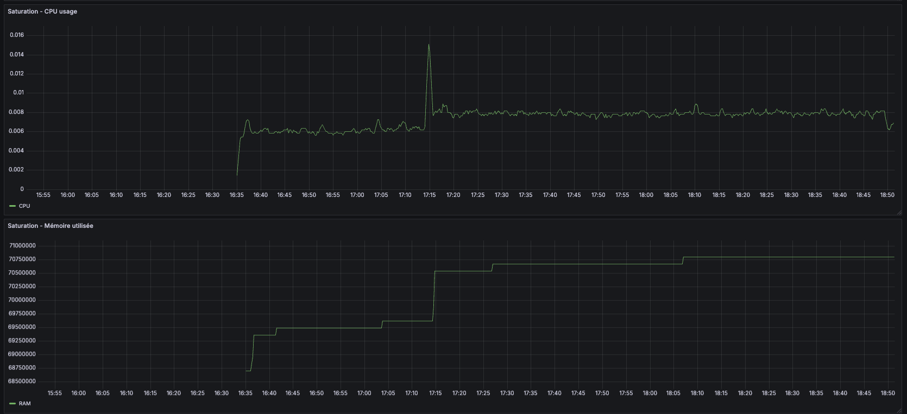
- **Fichiers ouverts** : 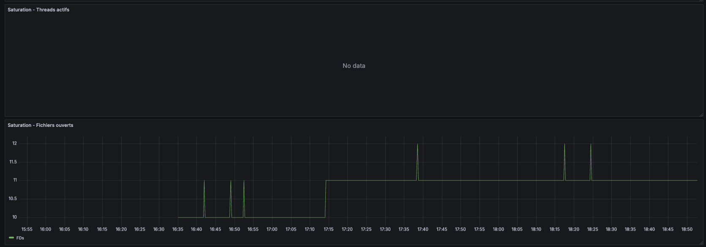 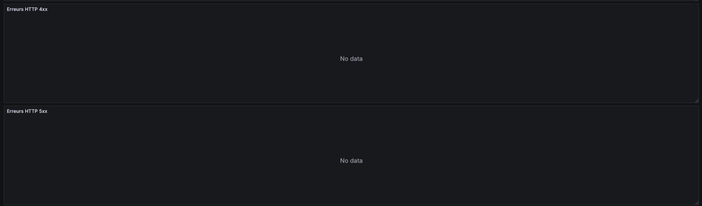

> Les graphiques qui ne présentent pas de data c'est parcequ'il n'y a pas de données d'erreur. 

### Explication des axes sur les graphes Grafana :

- **Axe des abscisses (horizontal)** : Temps (en heures:minutes)
- **Axe des ordonnées (vertical)** :
  - Pour la latence : temps de réponse en secondes
  - Pour la charge CPU : pourcentage d’utilisation (de 0 à 1 = 0% à 100%)
  - Pour la mémoire : en octets
  - Pour les requêtes par seconde : nombre de requêtes traitées par seconde

---

## 3. Résultats des tests de charge (K6 + Grafana)

### Scénario 1 — Infrastructure de base (sans cache, sans load balancer)
L'objectif c'est d'évaluer les performances de l'application dans sa version initiale.

#### A: Consultation simultanée des stocks
Ce test simule une charge générée par 80 utilisateurs virtuels (VUs) accédant simultanément aux stocks de trois magasins via l’API REST (GET /api/magasins/:id), avec authentification Bearer. Le fichier de test est dans le dossier `src/k6/test_stocks.js`

Voici les conditions : 
>p(95)<500 : 95% des requêtes doivent répondre en moins de 500 ms.

>rate<0.01 : Moins de 1% d'échecs tolérés.

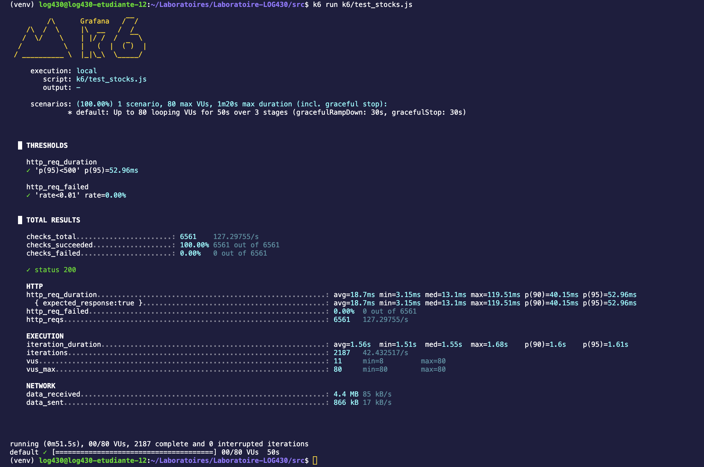
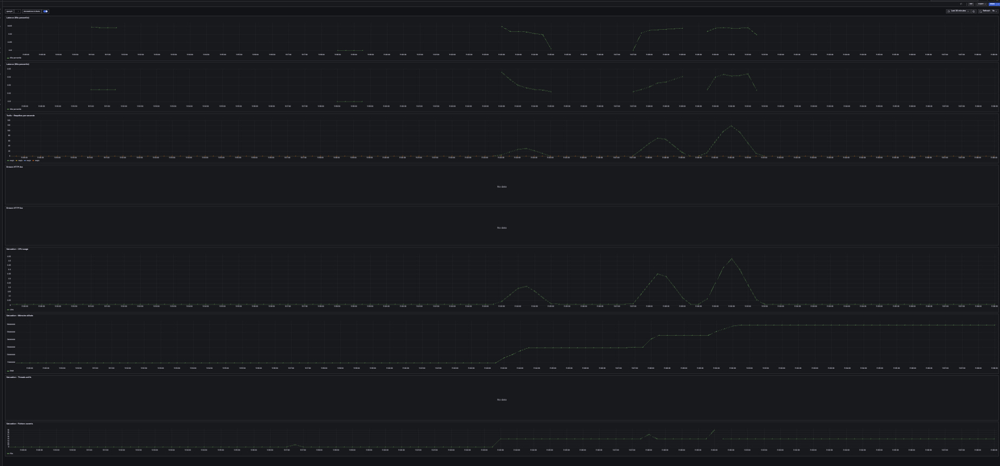

✅ Résultats observés :
- Total des requêtes HTTP : 6561
- Taux de succès : 100% (6561/6561)
- Durée moyenne de requête : ~18.7 ms (p95 = 52.96 ms)
- Durée moyenne d'une itération : ~1.56 s
- Aucun échec constaté (http_req_failed = 0.00%)

#### B: Génération de rapports consolidés
L'objectif est de tester la robustesse du serveur avec jusqu’à 500 utilisateurs simultanés accédant à un rapport. Le fichier de test est dans le dossier `src/k6/test_reports.js`


Résultats :
- ❌ 10 510 requêtes, dont 1.86% échouées (soit 196 erreurs)
- ❌ 98 requêtes n’ont pas renvoyé de status 200
- ❌ Check rapport contient données échoué dans 98 cas (données manquantes ou incorrectes)
- ❌ Seuil p(95)<500ms non respecté :
  - Temps de réponse p(95) : ~12.1s
  - Max : ~52.8s
- ❌ Le système a montré des signes de saturation au-delà de 4 VUs effectifs (malgré la cible de 500)

Conclusion :
Le endpoint /api/rapport ne tient pas la charge à grande échelle (≥ 500 VUs). Il nécessite : une optimisation backend (base de données, logique métier)

Voici les résultats à Faible charge : 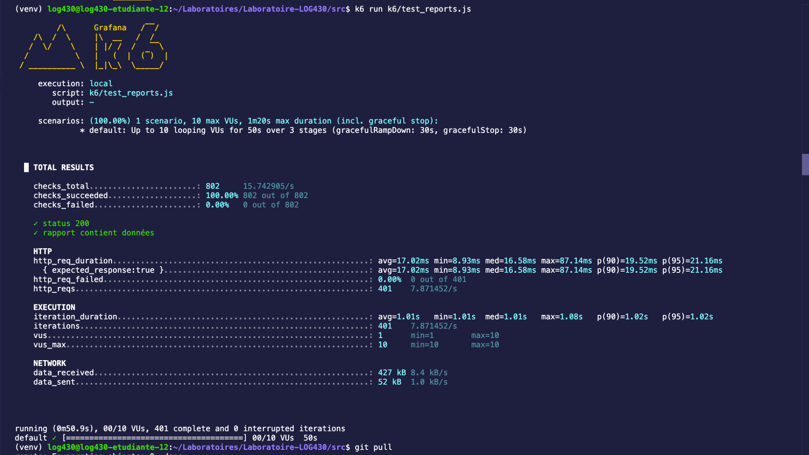


Voici les resultat à forte charge : 
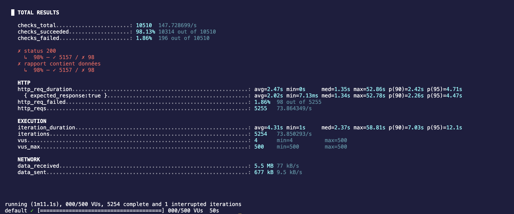
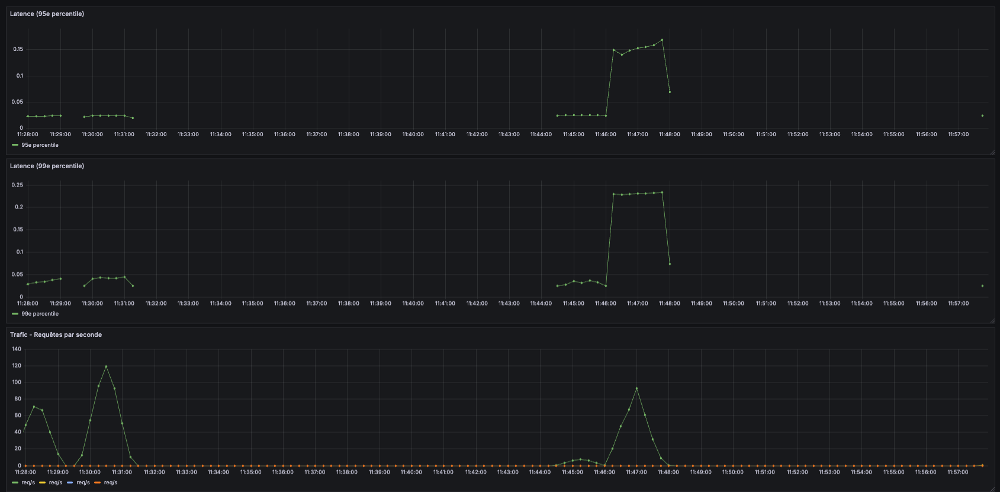
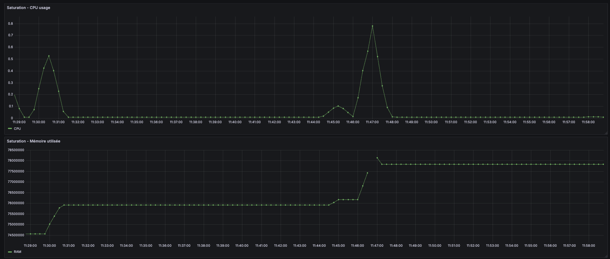

#### C: Mise à jour de produits à forte fréquence
L'objectif est de mettre à jour un produit (productId = 1) de manière concurrente en simulant jusqu’à 500 utilisateurs virtuels (vus) durant 30 secondes

On a effectué 2 tests avec des charges utilisateurs differents et bien evidamment comme avec les autres API des qu'on passe au dessus de 50 users l'application Python n'est plus capable de repondre à 100% des requetes.

✅ Test 1 : Charge modérée (40 VUs max)
- Nombre total de requêtes : 1200
- Taux de succès : 100%
- Durée moyenne des requêtes : 24.5 ms
- Aucune erreur HTTP détectée

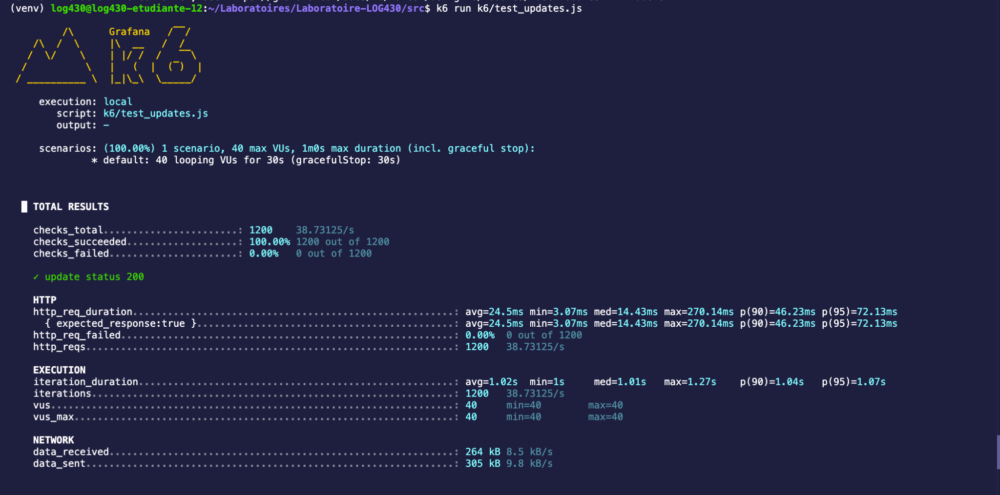

Le serveur a parfaitement géré la charge, avec un temps de réponse stable et rapide.

⚠️ Test 2 : Charge élevée (500 VUs)
- Nombre total de requêtes : 4736
- Taux de succès : 99.66%
- Taux d’échec : 0.33% (16 erreurs)
- Durée moyenne des requêtes HTTP : ~2s
- Pire temps de réponse : 53.01s
- Durée d’exécution moyenne : 3.56s, avec un pic à 56.14s

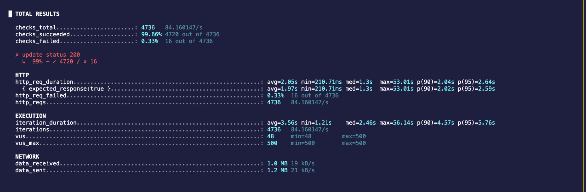


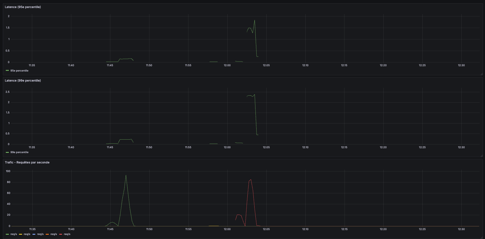
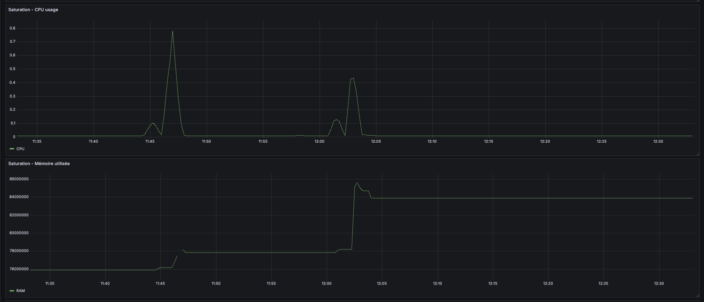

**Cela indique une limite d’échelle au-delà de laquelle une mise en cache, un load balancing ou une optimisation du backend serait nécessaire.**

Ainsi c'est pour cela que nous allons passer au scénario 2. 

### Scénario 2 — Ajout du Load Balancer
Objectif : Répartir la charge entre plusieurs instances de l’application.

Un Load Balancer (répartiteur de charge) reçoit les requêtes entrantes des utilisateurs et les répartit intelligemment entre plusieurs instances de l'application Flask (ex : web1, web2, etc.) pour :

- éviter qu’une seule instance ne soit surchargée,
- améliorer les performances,
- garantir la résilience (si une instance tombe, les autres prennent le relais).

Je vais choisir NGINX, il est tres populaire et facile à configurer. C'est tres simple il suffit de créer un simple fichier `nginx.conf` pour répartir les requêtes entre les containers.

#### Load Balancing avec NGINX

JE vais utilisé NGINX comme répartiteur de charge. Il a été configuré pour distribuer les requêtes entrantes vers plusieurs instances du service API (`web1`, `web2`, etc.) en utilisant la stratégie Round Robin. Cela permet d’améliorer la scalabilité et la tolérance aux pannes.


### Scénario 3 — Ajout du cache (Redis)
Objectif : Réduire les accès fréquents à la base de données et améliorer la latence.

---

## 5. Objectifs pédagogiques

- Utiliser un outil de test de charge (K6)
- Observer les métriques d’un système web via Prometheus + Grafana
- Identifier les goulots d’étranglement
- Implémenter des solutions d’amélioration (cache, équilibrage de charge)
- Évaluer l’impact sur les performances

##  Instructions
## Prérequis
- Python 3.11  
- Docker & Docker Compose  
- (Optionnel) `venv` ou `virtualenv` pour isoler l’environnement Python  

## Installation locale et exécution

1. **Cloner le projet**  
   ```bash
   git clone https://github.com/zakzaki244/Laboratoires-LOG430.git
   cd Laboratoires-LOG430
   git checkout lab4

2. **Environnement Python**
   Optionnel : créer et activer un environnement virtuel
   ```bash
   python3 -m venv .venv
   source .venv/bin/activate et/ou sur Windows : venv\Scripts\activate
   pip install --upgrade pip
   pip install -r requirements.txt
   
4. **Lancer l'application interface web**  
   ```bash
   Ouvre le navigateur à l’adresse : http://10.194.32.174:5000/

5. **Tests unitaires**  
   ```bash
   pytest tests/

## Installation Conteneurisation & orchestration 

1. **Docker Compose**  
   ```bash
   docker compose up --build
   et pour arrêter et supprimer les conteneurs :
   docker-compose down
