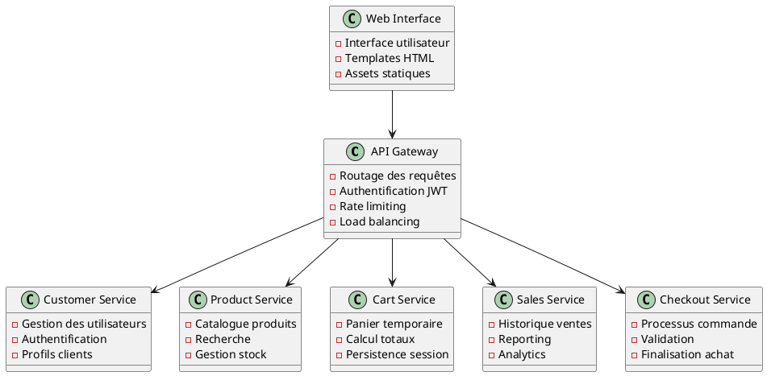

# Lab4-LOG430 – Test de charge et Observabilite

[](https://github.com/zakzaki244/Lab0-LOG430/actions)

Dans ce laboratoire j'ai effectué la correction des remarques du professeur Fabio et implémenter les fonctionnalitées correctement !
Vous pouvez essayer toute les nouvelles fonctionnalitées : `http://10.194.32.174:5000/login`
# Documentation Arc42 - Système E-commerce Microservices

## 📋 Vue d'ensemble

Cette documentation suit le template Arc42 pour décrire l'architecture du système e-commerce basé sur des microservices en Python/Flask. Elle couvre tous les aspects architecturaux nécessaires pour comprendre, maintenir et faire évoluer le système.

## 🏗️ Architecture du Système

### Microservices Principaux



## 🎯 Points Clés de l'Architecture

### 1. Patterns Architecturaux Utilisés

- **Microservices** : Décomposition en services indépendants
- **API Gateway** : Point d'entrée unique pour les clients
- **Database per Service** : Isolation des données par service
- **CQRS** : Séparation lecture/écriture pour certains services
- **Event Sourcing** : Traçabilité des changements d'état
- **Circuit Breaker** : Résilience et tolérance aux pannes

### 2. Technologies Clés

- **Python 3.9+** : Langage principal
- **Flask** : Framework web léger
- **PostgreSQL** : Base de données relationnelle
- **Redis** : Cache et sessions
- **Docker** : Conteneurisation
- **NGINX** : Reverse proxy et load balancer
- **JWT** : Authentification et autorisation

### 3. Qualité et Monitoring

- **Prometheus** : Collecte de métriques
- **Grafana** : Visualisation
- **Jaeger** : Tracing distribué
- **ELK Stack** : Logging centralisé
- **Tests automatisés** : Couverture > 80%

## 🔧 Démarrage Rapide

### Prérequis

```bash
# Installer Docker et Docker Compose
brew install docker docker-compose

# Cloner le repository
git clone https://github.com/zakzaki244/Laboratoires-LOG430.git 
cd Laboratoires/
cd Laboratoire-LOG430/
git checkout TEST-LAB5-fonctionnalitepourlab6
```

### Lancement du Système

```bash
# Arrête et supprime tous les containers (y compris orphelins)
docker-compose down --remove-orphans

# Supprime toutes les images non utilisées (pour forcer la reconstruction)
docker image prune -a -f

# Supprime tous les volumes (pour repartir d’une base propre)
docker volume prune -f

# Supprime tous les containers stoppés (au cas où il en reste)
docker ps -a

# (Optionnel) Supprime les images spécifiques si elles persistent
docker images

# Rebuild de tous les services sans cache
docker-compose build --no-cache

# Relance tous les services en arrière-plan
docker-compose up -d


```

### Accès aux Services

| Service | URL | Description |
|---------|-----|-------------|
| API Gateway | [http://10.194.32.174:8080/| Point d'entrée principal |
| Web Interface | http://10.194.32.174:5000/login | Interface utilisateur |

## 📊 Métriques et Monitoring

### Métriques Techniques
NON IMPLEMENTEE
