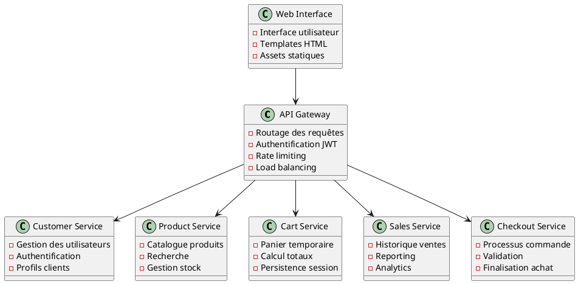

# Documentation Arc42 - Système E-commerce Microservices

## 📋 Vue d'ensemble

Cette documentation suit le template Arc42 pour décrire l'architecture du système e-commerce basé sur des microservices en Python/Flask. Elle couvre tous les aspects architecturaux nécessaires pour comprendre, maintenir et faire évoluer le système.

## 🏗️ Architecture du Système

### Microservices Principaux



## 📚 Structure de la Documentation

### Sections Complètes

| Section | Fichier | Contenu |
|---------|---------|---------|
| 1-2 | [section_1_2_arc42.md](section_1_2_arc42.md) | Introduction, Objectifs, Contraintes |
| 3-4 | [section_3_4_arc42.md](section_3_4_arc42.md) | Contexte, Stratégie de Solution |
| 5-6-7 | [section_5_6_7_arc42.md](section_5_6_7_arc42.md) | Vues Architecturales |
| 8-9 | [section_8_9_arc42.md](section_8_9_arc42.md) | Concepts Transversaux, ADR |
| 10-11 | [section_10_11_arc42.md](section_10_11_arc42.md) | Qualité, Risques |
| 12 | [section_12_glossaire_arc42.md](section_12_glossaire_arc42.md) | Glossaire |

### Outils et Scripts

| Outil | Fichier | Description |
|-------|---------|-------------|
| Générateur de Diagrammes | [generate_diagrams.py](../scripts/generate_diagrams.py) | Génération automatique de diagrammes PlantUML |
| Analyseur de Code | [analyze_architecture.py](../scripts/analyze_architecture.py) | Analyse statique de l'architecture |
| Générateur de Métriques | [generate_metrics.py](../scripts/generate_metrics.py) | Collecte de métriques architecturales |

## 🎯 Points Clés de l'Architecture

### 1. Patterns Architecturaux Utilisés

- **Microservices** : Décomposition en services indépendants
- **API Gateway** : Point d'entrée unique pour les clients
- **Database per Service** : Isolation des données par service
- **CQRS** : Séparation lecture/écriture pour certains services
- **Event Sourcing** : Traçabilité des changements d'état
- **Circuit Breaker** : Résilience et tolérance aux pannes

### 2. Technologies Clés

- **Python 3.9+** : Langage principal
- **Flask** : Framework web léger
- **PostgreSQL** : Base de données relationnelle
- **Redis** : Cache et sessions
- **Docker** : Conteneurisation
- **NGINX** : Reverse proxy et load balancer
- **JWT** : Authentification et autorisation

### 3. Qualité et Monitoring

- **Prometheus** : Collecte de métriques
- **Grafana** : Visualisation
- **Jaeger** : Tracing distribué
- **ELK Stack** : Logging centralisé
- **Tests automatisés** : Couverture > 80%

## 🔧 Démarrage Rapide

### Prérequis

```bash
# Installer Docker et Docker Compose
brew install docker docker-compose

# Cloner le repository
git clone <repository-url>
cd microservices-ecommerce
```

### Lancement du Système

```bash
# Démarrer tous les services
docker-compose up -d

# Initialiser les données de test
python init_all_data.py

# Vérifier l'état des services
docker-compose ps
```

### Accès aux Services

| Service | URL | Description |
|---------|-----|-------------|
| API Gateway | http://localhost:8080 | Point d'entrée principal |
| Web Interface | http://localhost:3000 | Interface utilisateur |
| Prometheus | http://localhost:9090 | Métriques système |
| Grafana | http://localhost:3001 | Dashboards |

## 📊 Métriques et Monitoring

### Métriques Techniques

```python
# Exemple de collecte de métriques
from prometheus_client import Counter, Histogram, Gauge

# Compteurs
http_requests_total = Counter('http_requests_total', 'Total HTTP requests')
http_request_duration = Histogram('http_request_duration_seconds', 'HTTP request duration')

# Jauges
active_users = Gauge('active_users', 'Number of active users')
database_connections = Gauge('database_connections', 'Active database connections')
```

### Métriques Métier

- **Taux de conversion** : Visiteurs → Commandes
- **Panier moyen** : Valeur moyenne des paniers
- **Taux d'abandon** : Paniers abandonnés
- **Performance** : Temps de réponse par endpoint

## 🔐 Sécurité

### Authentification JWT

```python
# Exemple d'implémentation JWT
import jwt
from datetime import datetime, timedelta

def generate_token(user_id):
    payload = {
        'user_id': user_id,
        'exp': datetime.utcnow() + timedelta(hours=24),
        'iat': datetime.utcnow()
    }
    return jwt.encode(payload, SECRET_KEY, algorithm='HS256')

def verify_token(token):
    try:
        payload = jwt.decode(token, SECRET_KEY, algorithms=['HS256'])
        return payload['user_id']
    except jwt.ExpiredSignatureError:
        raise AuthenticationError('Token expiré')
    except jwt.InvalidTokenError:
        raise AuthenticationError('Token invalide')
```

### Validation des Données

```python
# Validation avec marshmallow
from marshmallow import Schema, fields, validate

class ProductSchema(Schema):
    name = fields.Str(required=True, validate=validate.Length(min=1, max=100))
    price = fields.Decimal(required=True, validate=validate.Range(min=0))
    description = fields.Str(validate=validate.Length(max=1000))
    category_id = fields.Int(required=True)
```

## 🚀 Déploiement

### Environnements

#### Développement
```yaml
# docker-compose.dev.yml
version: '3.8'
services:
  api-gateway:
    build: ./api-gateway
    ports:
      - "8080:5000"
    environment:
      - FLASK_ENV=development
      - LOG_LEVEL=DEBUG
```

#### Production
```yaml
# docker-compose.prod.yml
version: '3.8'
services:
  api-gateway:
    image: registry.company.com/api-gateway:latest
    deploy:
      replicas: 3
      resources:
        limits:
          cpus: '0.5'
          memory: 512M
```

### CI/CD Pipeline

```yaml
# .github/workflows/deploy.yml
name: Deploy to Production
on:
  push:
    branches: [ main ]

jobs:
  test:
    runs-on: ubuntu-latest
    steps:
      - uses: actions/checkout@v2
      - name: Run tests
        run: |
          docker-compose -f docker-compose.test.yml up --abort-on-container-exit
  
  deploy:
    needs: test
    runs-on: ubuntu-latest
    steps:
      - name: Deploy to production
        run: |
          docker-compose -f docker-compose.prod.yml up -d
```

## 📈 Évolution et Maintenance

### Roadmap Technique

#### Phase 1 (Q1 2024)
- [ ] Implémentation du monitoring complet
- [ ] Amélioration des tests automatisés
- [ ] Optimisation des performances

#### Phase 2 (Q2 2024)
- [ ] Migration vers Kubernetes
- [ ] Implémentation de l'Event Sourcing
- [ ] Service mesh avec Istio

#### Phase 3 (Q3 2024)
- [ ] Intelligence artificielle pour recommandations
- [ ] Système de notifications temps réel
- [ ] Analyse prédictive des stocks

### Métriques de Qualité

| Métrique | Objectif | Actuel | Tendance |
|----------|----------|---------|----------|
| Couverture de tests | >80% | 65% | ↗️ |
| Temps de réponse | <2s | 1.5s | ↗️ |
| Disponibilité | >99.9% | 99.5% | ↗️ |
| Dette technique | <20% | 35% | ↘️ |

## 🎓 Formation et Onboarding

### Ressources pour Nouveaux Développeurs

1. **[Guide de Démarrage](onboarding/getting_started.md)**
2. **[Standards de Code](onboarding/coding_standards.md)**
3. **[Architecture Overview](onboarding/architecture_tour.md)**
4. **[Debugging Guide](onboarding/debugging.md)**

### Ressources Externes

- [Flask Documentation](https://flask.palletsprojects.com/)
- [Docker Best Practices](https://docs.docker.com/develop/best-practices/)
- [Microservices Patterns](https://microservices.io/patterns/)
- [Arc42 Template](https://arc42.org/)

## 📞 Support et Contact

### Équipe Architecture

- **Architecte Principal** : [nom@company.com](mailto:nom@company.com)
- **Tech Lead** : [lead@company.com](mailto:lead@company.com)
- **DevOps** : [ops@company.com](mailto:ops@company.com)

### Canaux de Communication

- **Slack** : #architecture-team
- **Jira** : [Architecture Board](https://company.atlassian.net/secure/RapidBoard.jspa)
- **Confluence** : [Architecture Wiki](https://company.atlassian.net/wiki/spaces/ARCH)

---

*Cette documentation est vivante et évolue avec le système. Pour toute question ou contribution, n'hésitez pas à contacter l'équipe d'architecture.*
