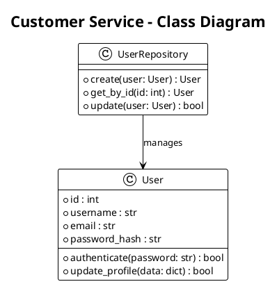

# Scripts d'Analyse et de Documentation

Ce répertoire contient des scripts Python pour analyser l'architecture, générer des diagrammes et collecter des métriques du système e-commerce microservices.

## 📋 Scripts Disponibles

### 1. `generate_diagrams.py` - Générateur de Diagrammes PlantUML

Génère automatiquement des diagrammes de classes PlantUML à partir du code source Python.

**Utilisation:**
```bash
# Générer tous les diagrammes
python generate_diagrams.py --all

# Générer le diagramme d'un service spécifique
python generate_diagrams.py --service customer-service

# Spécifier un répertoire de sortie
python generate_diagrams.py --all --output ./my-diagrams

# Générer un rapport de synthèse
python generate_diagrams.py --all --report
```

**Fonctionnalités:**
- ✅ Extraction automatique des classes Python
- ✅ Génération de diagrammes PlantUML par service
- ✅ Diagramme global de toutes les entités
- ✅ Diagramme d'architecture de haut niveau
- ✅ Rapport de synthèse avec statistiques

**Sortie:**
```
./diagrams/
├── customer-service_classes.puml
├── product-service_classes.puml
├── cart-service_classes.puml
├── global_classes.puml
├── architecture_overview.puml
└── generation_report.json
```

### 2. `analyze_architecture.py` - Analyseur d'Architecture

Analyse l'architecture du système pour détecter les problèmes et calculer les métriques.

**Utilisation:**
```bash
# Analyser tous les services
python analyze_architecture.py --all

# Analyser un service spécifique
python analyze_architecture.py --service product-service

# Générer un rapport Markdown
python analyze_architecture.py --all --format markdown

# Générer un rapport HTML
python analyze_architecture.py --all --format html
```

**Fonctionnalités:**
- ✅ Analyse des dépendances entre services
- ✅ Détection des dépendances circulaires
- ✅ Calcul de la cohésion des modules
- ✅ Mesure de la complexité cyclomatique
- ✅ Rapports multi-formats (JSON, Markdown, HTML)

**Métriques calculées:**
- **Cohésion** : LCOM (Lack of Cohesion of Methods)
- **Complexité** : Complexité cyclomatique
- **Couplage** : Dépendances inter-services
- **Qualité** : Scores de qualité globaux

### 3. `generate_metrics.py` - Générateur de Métriques

Collecte des métriques détaillées sur le code, les tests et la sécurité.

**Utilisation:**
```bash
# Générer toutes les métriques
python generate_metrics.py --all

# Métriques d'un service spécifique
python generate_metrics.py --service cart-service

# Export en CSV
python generate_metrics.py --all --format csv

# Export pour Prometheus
python generate_metrics.py --all --format prometheus
```

**Fonctionnalités:**
- ✅ Métriques de code (lignes, complexité, commentaires)
- ✅ Métriques de tests (couverture, nombre de tests)
- ✅ Métriques de sécurité (vulnérabilités potentielles)
- ✅ Export multi-formats (JSON, CSV, Prometheus)

**Métriques collectées:**
- **Code** : Lignes de code, commentaires, complexité
- **Tests** : Nombre de tests, densité de tests
- **Sécurité** : Scan de vulnérabilités, secrets hardcodés
- **Qualité** : Scores de qualité A-F

## 🚀 Démarrage Rapide

### Prérequis

```bash
# Python 3.7+
python --version

# Installer les dépendances (si nécessaire)
pip install ast-tools pathlib
```

### Analyse Complète

```bash
# Générer tous les diagrammes et analyses
./run_full_analysis.sh

# Ou manuellement :
python generate_diagrams.py --all --report
python analyze_architecture.py --all --format markdown
python generate_metrics.py --all --format json
```

### Résultats

Après exécution, vous obtiendrez :

```
./
├── diagrams/           # Diagrammes PlantUML
├── analysis/           # Rapports d'analyse
├── metrics/            # Métriques de qualité
└── scripts/            # Scripts d'automatisation
```

## 📊 Exemples de Sortie

### Diagramme de Classes (PlantUML)



### Métriques de Qualité (JSON)

```json
{
  "service_name": "customer-service",
  "code_metrics": {
    "totals": {
      "files": 8,
      "total_lines": 1250,
      "code_lines": 950,
      "classes": 5,
      "functions": 32
    },
    "quality_indicators": {
      "overall_quality": 85.5,
      "quality_grade": "B"
    }
  },
  "test_metrics": {
    "total_tests": 28,
    "test_density": 87.5
  },
  "security_metrics": {
    "total_issues": 2,
    "security_score": 90
  }
}
```

### Analyse d'Architecture (Markdown)

```markdown
# Analyse d'Architecture - Système E-commerce

## Métriques Globales

- **Services totaux**: 6
- **Classes totales**: 28
- **Fonctions totales**: 156
- **Cohésion moyenne**: 0.78
- **Complexité moyenne**: 3.2

## Dépendances Circulaires

Aucune dépendance circulaire détectée.

## Analyse par Service

### customer-service
- **Classes**: 5
- **Fonctions**: 32
- **Cohésion**: 0.85
- **Complexité**: 2.8
```

## 🛠️ Personnalisation

### Ajouter de Nouveaux Patterns

Pour étendre l'analyse de sécurité :

```python
# Dans generate_metrics.py
self.security_patterns = {
    'hardcoded_secrets': [...],
    'custom_pattern': [
        r'your_custom_regex_here'
    ]
}
```

### Nouveaux Formats d'Export

Pour ajouter un nouveau format :

```python
def export_to_new_format(self, metrics: Dict[str, Any], filename: str):
    # Votre logique d'export ici
    pass
```

### Métriques Personnalisées

```python
class CustomMetricsCollector:
    def collect_custom_metrics(self, service_name: str):
        # Votre logique de collecte
        return custom_metrics
```

## 📈 Intégration CI/CD

### GitHub Actions

```yaml
name: Architecture Analysis
on: [push, pull_request]

jobs:
  analyze:
    runs-on: ubuntu-latest
    steps:
      - uses: actions/checkout@v2
      - name: Run Architecture Analysis
        run: |
          python scripts/analyze_architecture.py --all --format json
          python scripts/generate_metrics.py --all --format prometheus
```

### Jenkins Pipeline

```groovy
pipeline {
    agent any
    stages {
        stage('Architecture Analysis') {
            steps {
                script {
                    sh 'python scripts/analyze_architecture.py --all'
                    sh 'python scripts/generate_metrics.py --all'
                }
            }
        }
    }
}
```

## 🔧 Configuration

### Variables d'Environnement

```bash
# Répertoire de sortie par défaut
export ANALYSIS_OUTPUT_DIR="/path/to/output"

# Niveau de verbosité
export ANALYSIS_VERBOSE=1

# Format de sortie par défaut
export ANALYSIS_FORMAT="json"
```

### Fichier de Configuration

```json
{
  "analysis": {
    "output_dir": "./analysis",
    "exclude_patterns": ["__pycache__", ".git"],
    "security_scan": true,
    "complexity_threshold": 10
  },
  "metrics": {
    "collect_tests": true,
    "collect_security": true,
    "export_prometheus": true
  }
}
```

## 📋 Maintenance

### Mise à Jour des Scripts

```bash
# Vérifier les mises à jour
git pull origin main

# Tester les modifications
python -m pytest tests/test_scripts.py

# Exécuter une analyse complète
./run_full_analysis.sh
```

### Surveillance de la Qualité

```bash
# Surveiller l'évolution des métriques
python generate_metrics.py --all --format json > metrics_$(date +%Y%m%d).json

# Comparer avec les métriques précédentes
python compare_metrics.py metrics_20241201.json metrics_20241215.json
```

## 🆘 Dépannage

### Problèmes Courants

1. **Erreur de parsing Python** : Vérifiez la syntaxe des fichiers Python
2. **Permissions insuffisantes** : Assurez-vous d'avoir les droits de lecture
3. **Mémoire insuffisante** : Analysez les services un par un avec `--service`

### Logging de Debug

```bash
# Activer les logs détaillés
export PYTHONPATH=$PYTHONPATH:./scripts
python -v generate_diagrams.py --all
```

## 📚 Ressources

- [PlantUML Documentation](https://plantuml.com/)
- [AST Python Module](https://docs.python.org/3/library/ast.html)
- [Métriques de Qualité Logicielle](https://en.wikipedia.org/wiki/Software_metric)
- [Architecture Documentation](../docs/README_arc42.md)

## 🤝 Contribution

Pour contribuer aux scripts :

1. Fork le repository
2. Créer une branche feature
3. Ajouter des tests pour vos modifications
4. Créer une pull request

---

*Ces scripts sont conçus pour être exécutés régulièrement dans le cadre d'un processus d'amélioration continue de la qualité architecturale.*
